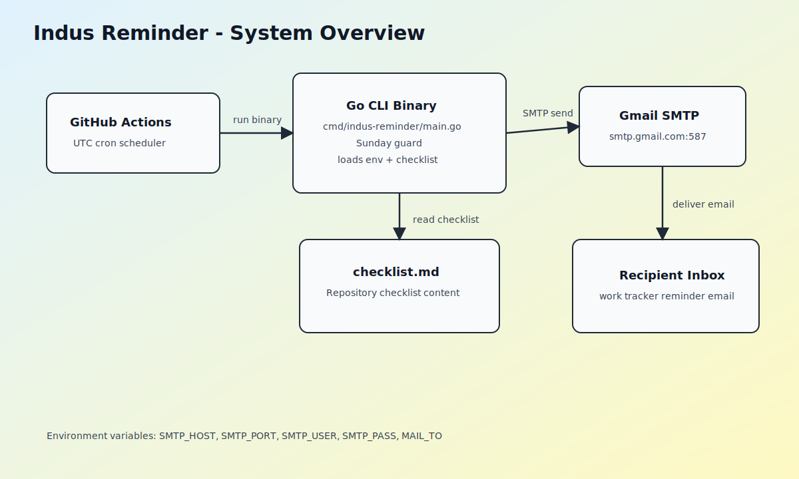
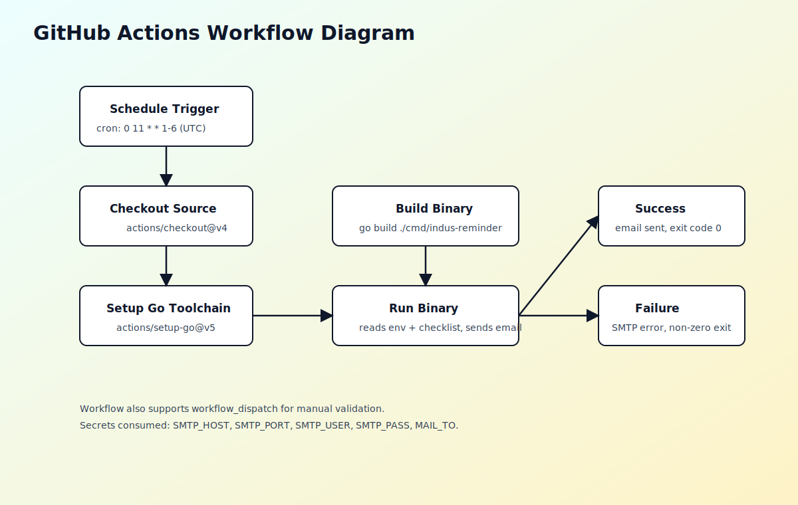
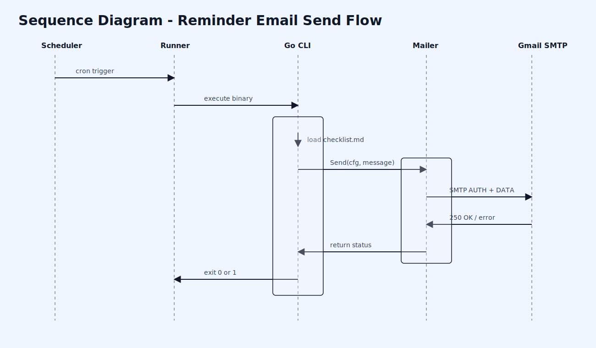
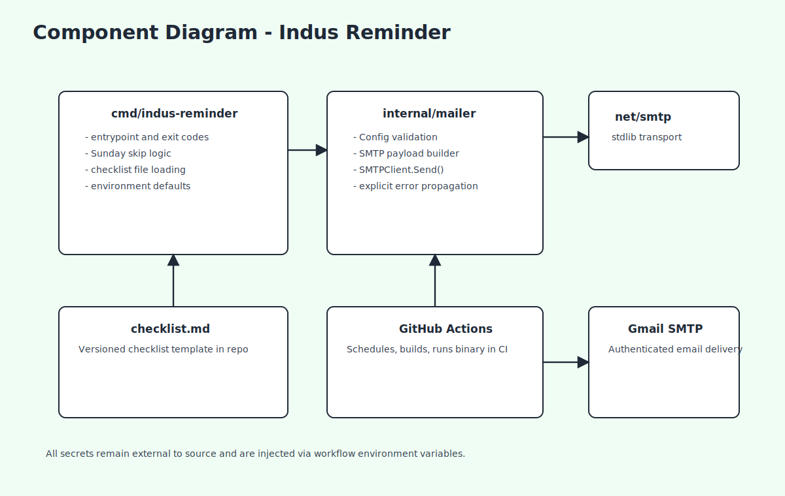
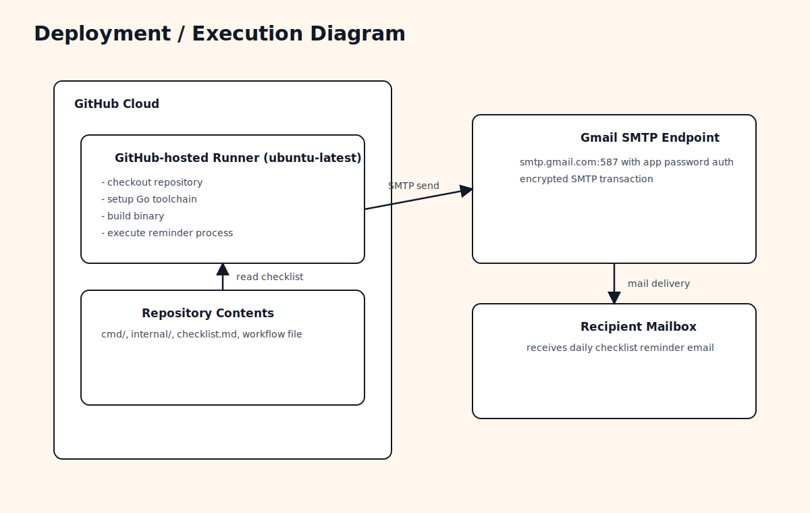
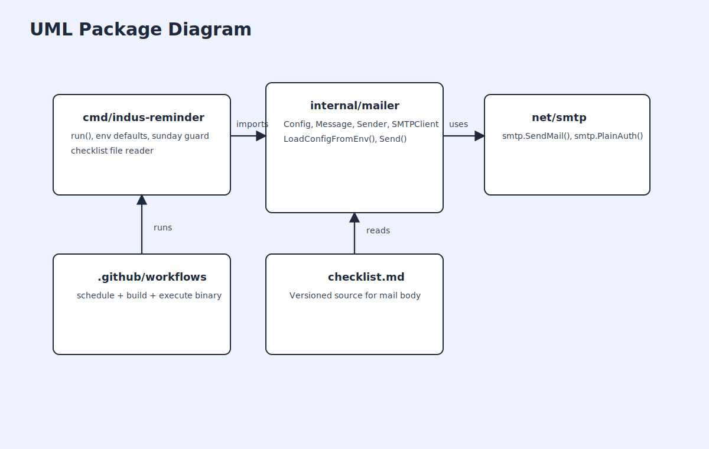

# Indus Reminder

`Indus Reminder` is a production-ready Go CLI automation tool that sends a daily reminder email through Gmail SMTP to ensure work trackers and personal checklists are updated consistently.

## Problem It Solves

Teams and individuals often forget end-of-day hygiene tasks (tracker updates, blockers, and personal follow-ups). This project enforces a reliable reminder cadence with a deterministic GitHub Actions schedule.

## How It Works

1. GitHub Actions triggers the job at a UTC cron time mapped to local 16:30.
2. The CLI loads `checklist.md` from the repository.
3. SMTP credentials and recipient are read from environment variables.
4. The CLI sends one email via Gmail SMTP.
5. Sundays are skipped both by cron (`1-6`) and by runtime guard.

## Scheduling (UTC to Local)

- Local timezone used: `Asia/Kolkata` (`UTC+05:30`)
- Target local send time: `16:30`
- Workflow cron: `0 11 * * 1-6`
- Conversion: `11:00 UTC + 05:30 = 16:30 IST`
- Sunday skip: Cron runs Monday-Saturday only (`1-6`), and the binary also exits early on local Sunday.

## Required Environment Variables

These must be provided at runtime (typically GitHub Secrets):

- `SMTP_HOST`
- `SMTP_PORT`
- `SMTP_USER`
- `SMTP_PASS`
- `MAIL_TO`

Optional:

- `MAIL_SUBJECT` (falls back to default subject if empty)
- `REMINDER_TZ` (default `Asia/Kolkata`)
- `CHECKLIST_FILE` (default `checklist.md`)

## GitHub Setup

1. Fork this repository.
2. Add repository secrets:
   - `SMTP_HOST` = `smtp.gmail.com`
   - `SMTP_PORT` = `587`
   - `SMTP_USER` = your Gmail address
   - `SMTP_PASS` = Gmail App Password
   - `MAIL_TO` = recipient email address
3. Optionally add repository variable `MAIL_SUBJECT`.
4. Enable Actions in your fork.
5. Run workflow manually once using `workflow_dispatch` to validate configuration.

## Local Build

```bash
go test ./...
go build ./cmd/indus-reminder
```

The binary is designed to run in GitHub Actions and returns an error if executed outside that environment.

## Repository Structure

```text
.
??? cmd/indus-reminder/main.go
??? internal/mailer/mailer.go
??? internal/mailer/mailer_test.go
??? checklist.md
??? .github/workflows/reminder.yml
??? docs/diagrams/
??? README.md
??? LICENSE
??? .gitignore
```

## Architecture & Workflows

### 1) System Overview



High-level view of scheduler, CLI, checklist source, SMTP, and recipient.

### 2) GitHub Actions Workflow



Shows scheduled trigger, build stage, run stage, and failure behavior.

### 3) Sequence: Email Send Flow



End-to-end call sequence from scheduler to SMTP delivery.

### 4) Component Diagram



Static component relationships inside the Go project.

### 5) Deployment / Execution Diagram



Execution topology of GitHub-hosted runner and external SMTP endpoint.

### 6) Data Flow Diagram


How configuration and checklist data move through the system.

### 7) UML Package Diagram



Package-level dependency direction and boundaries.

## Limitations

- GitHub scheduled workflows are best-effort and can be delayed by a few minutes.
- Cron is always evaluated in UTC.
- Gmail SMTP requires App Password when 2FA is enabled.
- This tool intentionally has no retry queue or persistent state.

## Security Notes

- No secrets are hardcoded in source, workflow, or documentation.
- SMTP credentials are loaded only from environment variables.
- Logs avoid printing passwords or secret values.

## License

MIT License. See [LICENSE](LICENSE).
